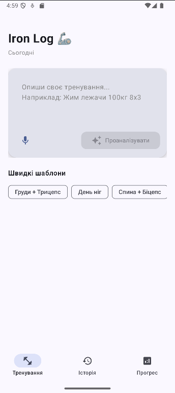
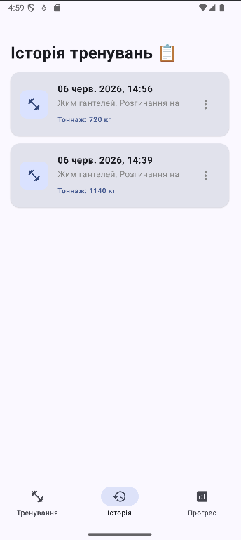
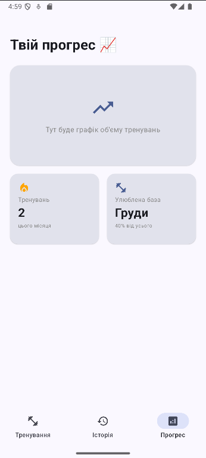

# Iron Log 🏋️‍♂️ 🦾

**Iron Log** — це сучасний Android-додаток для трекінгу тренувань з використанням штучного інтелекту. Замість того, щоб вручну вводити підходи та кілограми, користувач просто описує своє тренування вільним текстом, а ШІ (Gemini AI) автоматично розпізнає вправи, вагу та повторення, зберігаючи їх у зручному форматі.


## Основні можливості

* **AI-Аналіз тренувань:** Введення тексту вільним форматом (напр. *"Жим лежачи 100кг 8х3"*), який Gemini автоматично парсить у структурований JSON.
* **Нескінченна історія (Paging 3):** Плавне підвантаження історії тренувань з локальної бази даних.
* **Аналітика прогресу:** Автоматичний підрахунок загального тоннажу та визначення улюбленої групи м'язів.
* **Сучасний UI:** Повністю написаний на Jetpack Compose з підтримкою Material Design 3 та Type-Safe навігації.
* **Офлайн підтримка:** Всі дані надійно зберігаються на пристрої за допомогою бази даних Room.
## 📸 Скріншоти
| Головний екран | Історія тренувань | Аналітика прогресу |
| :---: | :---: | :---: |
|  |  |  |

##  Технологічний стек

Додаток побудований з використанням сучасних інструментів Android розробки:

* **UI:** Jetpack Compose, Material 3
* **Архітектура:** Clean Architecture, MVI / MVVM
* **Навігація:** Jetpack Navigation Compose (Type-Safe)
* **Локальна БД:** Room Database
* **Пагінація:** Paging 3
* **Dependency Injection:** Dagger Hilt
* **Асинхронність:** Kotlin Coroutines & Flow
* **Мережа & ШІ:** Google Generative AI (Gemini SDK)

##  Як запустити проект

1. Зклонуй репозиторій:
   ```bash
   git clone (https://github.com/liub-MM/IronLog.git)

2. Отримай безкоштовний API ключ для Gemini на Google AI Studio.

3. Додай свій ключ у файл local.properties:

4. Properties
   GEMINI_API_KEY="твій_ключ_тут"
5. Запусти додаток на емуляторі або реальному пристрої!